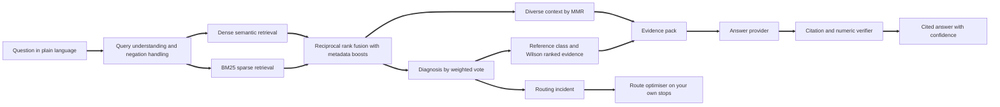
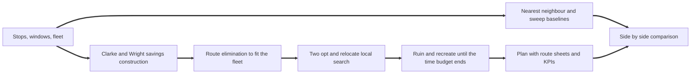
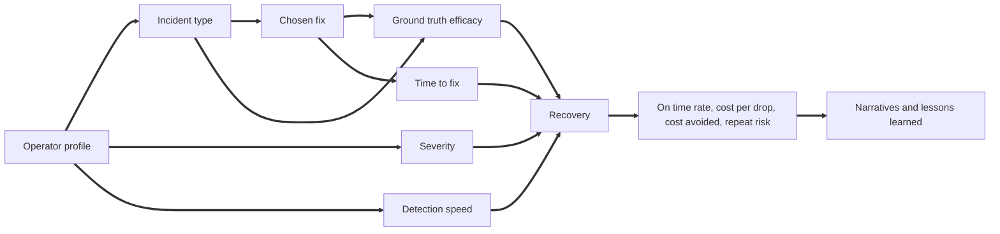

# Routewright AI

**Evidence grounded fixes and time window aware route planning for last mile delivery.**

Routewright AI combines two tools that last mile operators normally buy separately. The first is a retrieval augmented advisor: describe a delivery problem in plain language and it diagnoses the incident, finds the most comparable cases among 16,000 historical delivery incidents, ranks fixes by how often they genuinely restored on time performance, and writes a cited answer whose every precedent and statistic is verified. The second is a route optimiser that plans delivery runs against every customer time window, vehicle capacity and shift limit, and proves its value by benchmarking each plan against the methods planners use today.

## Project brief

Last mile delivery is the most expensive and least forgiving part of the supply chain. It often accounts for around half of total shipping cost, and every failure is visible to the end customer: a missed one hour slot, a card through the door when nobody was home, a driver still out long after the shift should have ended, a van that left the depot late and never caught up. Margins are thin, customer promises keep tightening, and operators face driver shortages, congestion, low emission zones and the move to electric fleets all at the same time. When on time performance drops, the cost compounds daily through redeliveries, overtime, penalties and lost clients.

The knowledge needed to fix these problems exists but is scattered. It sits in the heads of experienced transport managers, in incident reviews that nobody searches, and in dashboards that show that on time delivery has fallen without saying why. Under pressure, operations teams reach for the responses that feel fastest: longer shifts and more stops per route. Both push more work through a plan that is already failing. General purpose chat assistants offer generic advice with no evidence behind it and no sense of which fix works for a pallet network in a rural area as opposed to a grocery operation in a city centre. Most planning offices still build routes by hand or by fixed territories, so even the right diagnosis cannot easily be turned into a better plan for tomorrow.

Routewright AI was built to close both gaps. It treats delivery incidents as data: every case records the operator profile, the incident, the root cause, the fix, how quickly it was applied and what happened to on time performance, cost per drop and repeat risk afterwards. A statistical evidence engine ranks fixes using confidence bounds rather than anecdote, and the language model, when one is used, only explains that evidence and is checked for fabricated citations and numbers. When the diagnosis is a routing problem, the built in optimiser lets the operator test the fix on their own stops before a single van changes its route. The result behaves like a senior transport manager who remembers how thousands of incidents ended and can redraw tomorrow's plan in a second.

## What Routewright AI does

* **Diagnoses** a messy description into one or more of fifteen incident types, from delivery window misses and failed first attempts to electric van range shortfalls and proof of delivery disputes.
* **Understands negation**, so "vans are leaving late though traffic is normal" points at the depot rather than at congestion.
* **Retrieves** the most comparable precedents with a hybrid of BM25 and dense semantic search, fused by reciprocal rank and diversified so the evidence is not a list of near duplicates.
* **Recommends** fixes ranked by the lower bound of a Wilson confidence interval on full recovery, inside a reference class narrowed to your service type, area and fleet where the data supports it, with the usual owning team, typical cost, time to fix and cost avoided.
* **Warns** against fixes whose recovery rate is confidently below baseline, putting the most commonly tried mistakes first.
* **Quantifies** what to expect: typical on time rate during the incident, cost in days of delivery spend at median and P80, detection time, repeat risk, and how much a faster fix improves the odds.
* **Optimises routes** against time windows, capacity and shift length, and reports on time rate, distance, vehicles, overtime, cost and CO2 alongside two planner baselines.
* **Profiles** an operation before trouble starts, predicting incident exposure with the drivers behind each prediction and a prepared playbook.
* **Verifies** every answer: cited incident IDs must exist in the evidence and every percentage must match a number in the evidence, or the answer is replaced.
* **Exports** its knowledge as fine tuning data so any open model can learn the same grounded behaviour.

## Headline results

Measured by `python routewright.py evaluate`: 400 benchmark questions written in phrasing that never appears in the incident narratives, 20 percent of them describing two incidents at once; a separate held out bank that was never used for tuning; and 12 routing scenarios.

<table>
<tr><th>Measure</th><th>Result</th></tr>
<tr><td>Retrieval precision at 10, full hybrid pipeline</td><td>0.977 (BM25 alone 0.936, dense alone 0.943)</td></tr>
<tr><td>Primary diagnosis accuracy</td><td>98.3%, and 86.7% on the held out phrasing bank</td></tr>
<tr><td>Top recommended fix is genuinely strong</td><td>97.8%, against 65.8% and 73.1% for two naive RAG baselines</td></tr>
<tr><td>Answers recommending a harmful fix</td><td>0.0%</td></tr>
<tr><td>Answers passing citation and numeric verification</td><td>100%</td></tr>
<tr><td>Optimised plans serving every stop inside its window</td><td>12 of 12 scenarios, against about 51% on time for both planner baselines</td></tr>
<tr><td>Daily plan cost saving</td><td>36.8% against sweep territories and 19.3% against nearest neighbour planning</td></tr>
<tr><td>End to end answer latency, cache disabled</td><td>about 5 ms median, under 9 ms p95</td></tr>
<tr><td>Full rebuild from nothing: dataset, index and models</td><td>about 14 seconds on a laptop CPU</td></tr>
</table>

Two results matter most commercially. A naive RAG system that repeats what similar operators did inherits their mistakes, because under pressure teams extend shifts and load more stops; Routewright separates *what was done* from *what worked*. And the optimiser turns that advice into an actual plan: on the same travel model, it reaches every customer inside the promised window where the methods most planners use today miss about half of them.

## How it works



**1. Query understanding.** The question is normalised with the same tokenizer and stemmer used at index time. Conditions the user explicitly rules out, such as "traffic is normal" or "volume has not changed", are removed first. A domain thesaurus then detects likely incidents, so "nobody is home when we turn up" is recognised as failed first attempt deliveries, and synonym tables pick up service type, area and fleet context such as "grocery", "city centre" or "lorries".

**2. Hybrid retrieval.** BM25 term weights are precomputed per document into a compressed sparse column matrix, so scoring all 16,000 incidents is one column slice and one matrix vector product. The dense model is latent semantic analysis over unigrams and bigrams, reduced to 160 dimensions by truncated SVD. It needs no GPU, no model download and no network. Documents are expanded with the thesaurus of their own incident type, closing the gap between how incidents are written up and how operators describe them.

**3. Fusion and boosting.** The two rankings are combined with reciprocal rank fusion. Detected incidents and operator context apply soft multiplicative boosts, and caller supplied filters apply hard masks.

**4. Diagnosis.** The top incidents vote for their type, weighted by fused relevance and blended with the thesaurus prior. Up to three incident types are reported, so compound problems are handled explicitly.

**5. Evidence engine.** For each diagnosed incident, Routewright forms a reference class of every incident of that type and narrows it by service type, area and fleet only while it keeps at least 200 cases. For every fix used within the class it computes the full recovery rate, the Wilson lower and upper bounds, lift over baseline, repeat rate, on time recovery, cost avoided, days to recover, time to fix and fix cost. Recommendations are ranked by the lower bound; fixes whose upper bound sits below the baseline go on the avoid list. A timing analysis compares fast and slow fixes, and an outlook reports the typical cost of the incident in days of delivery spend.

**6. Context selection.** Maximal Marginal Relevance picks precedents that are relevant and distinct, and the best documented precedent for each recommended fix is added so every recommendation has a citable example.

**7. Generation and verification.** The evidence is written into a compact evidence pack. The default extractive provider writes the answer deterministically from it. When Claude or a local Ollama model is selected, the model sees only the evidence pack and a strict system prompt. Either way the verifier checks every cited ID and every percentage against the pack, and in strict mode a failing model answer is replaced with the extractive answer. When the diagnosis is a routing incident, the answer ends by pointing the operator at the optimiser.

## The route optimiser

`routewright_ai/optimiser.py` solves the capacitated vehicle routing problem with time windows. Every stop has a location, a demand, a delivery window and a service time; every vehicle has a capacity and a shift length.



* **Construction.** Clarke and Wright savings, restricted to each stop's nearest neighbours and checked for time window, capacity and shift feasibility at every merge.
* **Fleet fitting.** When the plan needs more vehicles than the fleet has, stops from the smallest routes are reinserted elsewhere. Stops that cannot be served inside their window are reported, never silently dropped.
* **Local search.** Two opt moves within each route and relocate moves between neighbouring routes, accepting only feasible improvements.
* **Ruin and recreate.** Until the time budget runs out, a random stop and its nearest neighbours are removed and greedily reinserted at their cheapest feasible positions, keeping the change only when the plan gets shorter without needing more vehicles. This escapes the local optima that pure local search gets stuck in, typically making over a thousand attempts per second.
* **Honest comparison.** Every plan is simulated with the same travel model as two baselines: greedy nearest neighbour routing that ignores windows, and sweep territories cut by angle around the depot, much like fixed postcode rounds. Plan cost counts distance at GBP 0.45 per kilometre, driver time at GBP 16.50 per hour, a 50 percent overtime premium and a GBP 3.50 service penalty for each stop served late or not at all. The constants are module level so operators can set their own.

<table>
<tr><th>Method, mean of 12 scenarios</th><th>On time</th><th>Distance</th><th>Vehicles</th><th>Overtime</th><th>Daily cost</th><th>Runtime</th></tr>
<tr><td>Routewright optimiser</td><td>100.0%</td><td>755 km</td><td>10.1</td><td>0 min</td><td>GBP 1,302</td><td>1.0 s</td></tr>
<tr><td>Nearest neighbour, windows ignored</td><td>51.8%</td><td>759 km</td><td>9.0</td><td>195 min</td><td>GBP 1,618</td><td>2 ms</td></tr>
<tr><td>Sweep territories</td><td>50.9%</td><td>1,244 km</td><td>9.0</td><td>349 min</td><td>GBP 2,066</td><td>0.2 ms</td></tr>
</table>

The scenarios cover four area types, three delivery promises and 90 to 200 stops. The optimiser always stays within the available fleet. On timed windows it deliberately uses one to three more of the available vans and a little more distance than nearest neighbour, because reaching every slot on time requires it; the baselines use fewer vans only by arriving late for about half their customers. On untimed work it uses the same number of vans as nearest neighbour and about 24% less distance.

Coordinates are kilometres on a local grid with the origin at the south west corner of the service area, so every value is positive, and times are minutes from the start of the shift. A 120 stop sample day is included at [data/sample_stops.csv](data/sample_stops.csv).

## The dataset

The incident base is a synthetic dataset of **16,000 last mile delivery incidents and 58 columns** produced by `routewright_ai/generator.py`, a vectorised causal simulator that regenerates the full set in about 1.2 seconds from a fixed seed. Numbers are driven by a causal model and every narrative is composed from the numbers in its own row, so text and fields never disagree.



* **Operator profiles** span 10 service types from parcel couriers to builders merchants, 5 area types, 10 regions, 4 size bands, 5 fleet types, 4 planning tools, 3 visibility levels and 5 delivery promises, from 20 to over 55,000 drops a day.
* **Incidents** are drawn from 15 types whose likelihood depends on the profile. Window misses are more likely with tight slots and manual planning, failed first attempts with residential drops and no notifications, congestion delays in dense urban areas, range shortfalls with electric fleets in winter and on rural routes, damage with bulky goods, and access breaches with rigid trucks in city centres.
* **Detection** depends on visibility: the median incident is spotted in about 3.6 hours with a real time control tower, 31 hours with daily dashboards and 104 hours with basic reporting.
* **Planning maturity matters.** During incidents, the median on time rate is 83.3% for operators using dynamic route optimisation against 73.1% for manual planning.
* **Fixes** are chosen the way real teams choose them. Mature operators pick proven fixes more often, and a share of teams reach for instinctive responses: extending driver shifts or loading more stops onto each route.
* **Recovery** depends on the ground truth efficacy of the fix, planning maturity, visibility, time to fix, detection lag and severity. Strong fixes fully recover about 62 percent of incidents and harmful ones about 8 percent. Strong fixes are followed by a repeat incident within 90 days 17 percent of the time, against 47 percent for harmful ones.

<table>
<tr><th>Column group</th><th>Columns</th></tr>
<tr><td>Operator identity</td><td>incident_id, operator_name, service_type, area_type, region, operator_size_band, fleet_type, planning_tool, visibility_level, delivery_promise, season</td></tr>
<tr><td>Operation</td><td>daily_drops, vehicles_in_fleet, drivers_employed, avg_stops_per_route, avg_route_km, avg_consignment_weight_kg, time_window_minutes, agency_driver_share_pct, depot_count, electric_share_pct</td></tr>
<tr><td>Detection</td><td>detection_date, resolution_date, detection_channel, detection_lag_hours</td></tr>
<tr><td>Incident</td><td>incident_type, severity, affected_shift, root_cause</td></tr>
<tr><td>Impact</td><td>baseline_on_time_rate_pct, incident_on_time_rate_pct, on_time_retention_ratio, first_attempt_success_pct, failed_deliveries_per_day, route_overrun_minutes, complaints_per_1000_drops, baseline_cost_per_drop_gbp, incident_cost_per_drop_gbp, daily_delivery_cost_gbp, incident_cost_gbp</td></tr>
<tr><td>Fix</td><td>fix_strategy, team_owner, time_to_fix_days, fix_cost_gbp</td></tr>
<tr><td>Outcome</td><td>recovery_status, post_fix_on_time_rate_pct, on_time_recovery_ratio, post_fix_cost_per_drop_gbp, cost_avoided_gbp_30d, days_to_recover, return_on_fix, co2_kg_per_drop, customer_satisfaction, repeat_incident_90d</td></tr>
<tr><td>Narrative</td><td>incident_summary, resolution_narrative, lessons_learned, tags</td></tr>
</table>

The full column reference is in [docs/DATA_DICTIONARY.md](docs/DATA_DICTIONARY.md) and the ground truth efficacy matrix is in [data/ground_truth_efficacy.json](data/ground_truth_efficacy.json). Every numeric value is non negative, and dates use the YYYY/MM/DD format.

## Quick start

Requires Python 3.10 or newer.

```bash
python install.py
python routewright.py all
python routewright.py ask "Our grocery drivers keep arriving outside the one hour slot customers booked. What should we do?"
python routewright.py optimise file=data/sample_stops.csv vehicles=9 capacity=74 area="Urban"
```

`install.py` installs the requirements with the current interpreter. `routewright.py all` generates the dataset, builds the index, trains the risk models, runs the benchmark including the optimiser scenarios, checks the house style and runs the test suite.

To add the optional Claude integration:

```bash
python install.py llm
```

To run the API in a container, with the index built into the image:

```bash
docker compose up
```

## Using Routewright AI

### Command line

All options are written as `key=value` pairs.

<table>
<tr><th>Command</th><th>Purpose</th></tr>
<tr><td><code>python routewright.py ask "question" provider=extractive k=8</code></td><td>Cited answer with diagnosis, ranked fixes, avoid list, timing, outlook and confidence. Add <code>json=1</code> for the full structured result.</td></tr>
<tr><td><code>python routewright.py optimise stops=120 area="Urban" promise="Two Hour Slot" seconds=1.5</code></td><td>Optimise a generated day and compare with the planner baselines.</td></tr>
<tr><td><code>python routewright.py optimise file=stops.csv vehicles=9 capacity=74 out=plan.json</code></td><td>Optimise your own stops and save the full plan with route sheets.</td></tr>
<tr><td><code>python routewright.py search "query" k=10 mode=hybrid</code></td><td>Most similar incidents. Modes are hybrid, fusion, bm25 and dense.</td></tr>
<tr><td><code>python routewright.py recommend incident="Route overruns" service_type="Parcel Courier"</code></td><td>Evidence table for every fix to a known incident type.</td></tr>
<tr><td><code>python routewright.py assess planning_tool="Manual Planning" visibility_level="Basic Reporting"</code></td><td>Incident exposure, drivers and playbook for an operator profile.</td></tr>
<tr><td><code>python routewright.py evaluate queries=400</code></td><td>Benchmark, written to reports/evaluation.json and docs/EVALUATION.md.</td></tr>
<tr><td><code>python routewright.py export_sft grounded=1000</code></td><td>Fine tuning data in chat JSONL format.</td></tr>
<tr><td><code>python routewright.py serve host=0.0.0.0 port=8000</code></td><td>REST API with interactive documentation at /docs.</td></tr>
<tr><td><code>python routewright.py ui</code></td><td>Web interface.</td></tr>
<tr><td><code>python routewright.py test</code> and <code>check_style</code></td><td>Test suite and house style check.</td></tr>
</table>

The stops CSV uses the columns stop_id, x_km, y_km, demand, window_start_min, window_end_min and service_min.

### Example answer

Question: *Our grocery drivers keep arriving outside the one hour slot customers booked. What should we do?*

```text
### Diagnosis
Your situation most closely matches delivery window misses (78% of the weighted evidence).

### Recommended fixes
1. Slot capacity control linked to route plans. Full recovery in 67% of 43 comparable
   incidents (statistical lower bound 53%), against a 35% baseline. On time delivery
   typically returned to 100% of its previous level in 11 days, avoiding GBP 65k of
   cost over 30 days for a median fix cost of GBP 4k. Precedent: [INC014930].
2. Dynamic route optimisation with time windows. Full recovery in 62% of 48 comparable
   incidents (statistical lower bound 48%). Precedent: [INC003833].

### Avoid
Extended driver shifts recovered fully in only 4% of 24 comparable incidents.

### What to expect
In this reference class (236 incidents of delivery window misses in Grocery Home
Delivery), on time delivery typically fell to 73.2% and the median incident cost
9.2 days of delivery cost.

### Test the fix on your own routes
This is a routing problem, so the built in optimiser can show the effect before
anything changes on the road.
```

The answer above is abridged. Every answer also carries the timing analysis, lessons from the closest precedents, a confidence statement, the full evidence tables, the precedent incidents, the verification report and a timing breakdown.

### REST API

<table>
<tr><th>Method and path</th><th>Purpose</th></tr>
<tr><td><code>GET /health</code></td><td>Liveness, incident count and uptime. Never requires a key.</td></tr>
<tr><td><code>POST /ask</code></td><td>Full answer. Body: question, optional filters, k, provider, strict, include_evidence_pack.</td></tr>
<tr><td><code>POST /optimise</code></td><td>Route plan and baseline comparison. Body: your own stops, or demo settings (area_type, promise, demo_stops, seed), plus vehicles, capacity, shift_minutes and seconds.</td></tr>
<tr><td><code>POST /search</code></td><td>Similar incidents. Body: query, filters, k, mode.</td></tr>
<tr><td><code>POST /recommend</code></td><td>Evidence ranked fixes. Body: incident, service_type, area_type, fleet_type.</td></tr>
<tr><td><code>POST /assess</code></td><td>Incident exposure and playbook for an operator profile.</td></tr>
<tr><td><code>GET /incidents/{incident_id}</code></td><td>One incident by ID.</td></tr>
<tr><td><code>GET /stats</code> and <code>GET /options</code></td><td>Incident base statistics and valid filter values.</td></tr>
</table>

```python
import httpx

stops = [
    {"stop_id": "A1", "x_km": 3.2, "y_km": 4.1, "demand": 2, "window_start_min": 60, "window_end_min": 180},
    {"stop_id": "A2", "x_km": 5.8, "y_km": 2.7, "demand": 1, "window_start_min": 0, "window_end_min": 600},
]
plan = httpx.post(
    "http://localhost:8000/optimise",
    json={"stops": stops, "vehicles": 2, "capacity": 40, "area_type": "Urban", "seconds": 1},
    headers={"Authorization": "Bearer your_key"},
).json()
print(plan["plan"]["on_time_pct"], plan["plan"]["routes"][0]["sequence"])
```

Set `ROUTEWRIGHT_API_KEY` to require the bearer token on every endpoint except health. Responses are gzip compressed, CORS origins are configurable and request bodies are validated with typed schemas, which reject negative coordinates and unknown areas.

### Web interface

`python routewright.py ui` opens five workspaces:

* **Diagnose**: question, filters and provider choice, the cited answer, headline metrics, evidence tables and charts, expandable precedent incidents and the verification report.
* **Route optimiser**: generate a demo day or upload a CSV, set the search time, and see the plan against both baselines, a map of stops coloured by vehicle and a route sheet for every van.
* **Incident explorer**: search the incident base with any retrieval method and read individual incidents.
* **Operator risk profile**: profile an operation and see predicted exposure, the drivers behind it and a prepared playbook with owning teams.
* **Incident insights**: statistics across the incident base and a per incident view of which fixes work, optionally within one service type.

## Language model providers

<table>
<tr><th>Provider</th><th>How to enable</th><th>When to use it</th></tr>
<tr><td>extractive</td><td>Default, nothing to configure</td><td>Offline, deterministic, free and instant. The benchmark figures use it.</td></tr>
<tr><td>anthropic</td><td><code>python install.py llm</code>, then set <code>ANTHROPIC_API_KEY</code>, <code>ROUTEWRIGHT_LLM_PROVIDER=anthropic</code> and <code>ROUTEWRIGHT_MODEL</code> to a Claude model id from the Anthropic documentation</td><td>The most natural, conversational answers over the same evidence.</td></tr>
<tr><td>ollama</td><td>Run Ollama locally, set <code>ROUTEWRIGHT_LLM_PROVIDER=ollama</code> and optionally <code>ROUTEWRIGHT_MODEL</code></td><td>Fully private deployments where no data may leave the network.</td></tr>
</table>

Model ids are deliberately not hard coded, so upgrading the model is a configuration change. Whichever provider is used, the verifier runs on every answer and strict mode is on by default.

## Configuration

<table>
<tr><th>Variable</th><th>Default</th><th>Meaning</th></tr>
<tr><td>ROUTEWRIGHT_LLM_PROVIDER</td><td>extractive</td><td>extractive, anthropic or ollama</td></tr>
<tr><td>ROUTEWRIGHT_MODEL</td><td>empty</td><td>Model id for the chosen provider</td></tr>
<tr><td>ROUTEWRIGHT_OLLAMA_URL</td><td>http://localhost:11434</td><td>Ollama server address</td></tr>
<tr><td>ROUTEWRIGHT_MAX_TOKENS</td><td>1200</td><td>Maximum answer length for model providers</td></tr>
<tr><td>ROUTEWRIGHT_API_KEY</td><td>empty</td><td>Enables bearer token authentication on the API</td></tr>
<tr><td>ROUTEWRIGHT_CORS</td><td>*</td><td>Comma separated list of allowed origins</td></tr>
<tr><td>ROUTEWRIGHT_ROWS and ROUTEWRIGHT_SEED</td><td>16000 and 42</td><td>Dataset size and random seed</td></tr>
<tr><td>ROUTEWRIGHT_EMBEDDING_DIMS</td><td>160</td><td>Dense embedding dimensions</td></tr>
<tr><td>ROUTEWRIGHT_BM25_K1 and ROUTEWRIGHT_BM25_B</td><td>1.4 and 0.72</td><td>BM25 saturation and length normalisation</td></tr>
<tr><td>ROUTEWRIGHT_RRF_K</td><td>60</td><td>Reciprocal rank fusion constant</td></tr>
<tr><td>ROUTEWRIGHT_CANDIDATE_POOL</td><td>400</td><td>Candidates kept from each retriever</td></tr>
<tr><td>ROUTEWRIGHT_EVIDENCE_MIN_CASES</td><td>200</td><td>Smallest reference class allowed when narrowing by context</td></tr>
<tr><td>ROUTEWRIGHT_CONTEXT_CASES</td><td>8</td><td>Precedents selected by MMR</td></tr>
<tr><td>ROUTEWRIGHT_MMR_LAMBDA</td><td>0.72</td><td>Relevance versus diversity balance</td></tr>
<tr><td>ROUTEWRIGHT_DATA_DIR, ROUTEWRIGHT_ARTIFACT_DIR, ROUTEWRIGHT_REPORT_DIR</td><td>data, artifacts, reports</td><td>Storage locations</td></tr>
</table>

## Evaluation

The benchmark scores questions against the generator's ground truth. A retrieved incident counts as relevant when it shares the question's incident type, and scores higher when it also shares the service type.

<table>
<tr><th>Retrieval method</th><th>Precision at 10</th><th>MRR</th><th>nDCG at 10</th><th>Median latency</th></tr>
<tr><td>BM25 only</td><td>0.936</td><td>0.971</td><td>0.971</td><td>0.9 ms</td></tr>
<tr><td>Dense only</td><td>0.943</td><td>0.964</td><td>0.965</td><td>1.1 ms</td></tr>
<tr><td>Rank fusion only</td><td>0.958</td><td>0.987</td><td>0.986</td><td>1.4 ms</td></tr>
<tr><td>Full hybrid with query understanding</td><td>0.977</td><td>0.987</td><td>0.987</td><td>1.3 ms</td></tr>
</table>

<table>
<tr><th>Fix ranking approach</th><th>Top fix is genuinely strong</th></tr>
<tr><td>Naive RAG, copy the most common fix among similar incidents</td><td>65.8%</td></tr>
<tr><td>Naive RAG, copy the most frequently successful fix</td><td>73.1%</td></tr>
<tr><td>Routewright evidence engine</td><td>97.8%</td></tr>
</table>

**Held out phrasing.** A second bank of 30 questions was written before any tuning and has never been used for it; the thesaurus was improved only by looking at failures on the main bank. On the held out bank, precision at 10 was 0.867, the primary diagnosis was correct in 86.7% of questions and the top fix was genuinely strong in 86.7%. This is the honest measure of how well understanding generalises to new wording, and the gap to the main benchmark shows where a real deployment would gain from a larger thesaurus or a neural embedding model.

**Avoid list.** 96.7% of fixes on the avoid list are ineffective or harmful by the ground truth. The remainder are moderately effective fixes that are slow to implement, where the data genuinely shows poor outcomes because failed deliveries accumulate while the work is under way.

<table>
<tr><th>Risk model</th><th>Held out result</th></tr>
<tr><td>Incident costs more than two weeks of delivery cost</td><td>AUC 0.755 (base rate 29.8%)</td></tr>
<tr><td>Incident undetected for more than 48 hours</td><td>AUC 0.812 (base rate 38.0%)</td></tr>
<tr><td>Incident recurs within 90 days</td><td>AUC 0.619 (base rate 27.9%)</td></tr>
<tr><td>Likely incident classifier, 15 classes</td><td>Top 3 accuracy 35.8% against 6.7% chance for a single guess</td></tr>
</table>

The risk models predict from the operator profile alone, before any incident happens. Detection speed and incident cost are strongly predictable because they depend on visibility and planning maturity, the levers an operator controls. Repeat risk depends mostly on how the team responds, which is what the evidence engine addresses. The full report is regenerated by `python routewright.py evaluate` into [docs/EVALUATION.md](docs/EVALUATION.md).

## Efficiency

* **No GPU, no model downloads, no vector database, no solver licence.** The whole stack is numpy, scipy, pandas, FastAPI and Streamlit. Artifacts total about 25 MB.
* **Precomputed BM25.** Query scoring is one sparse slice and one product, under a millisecond for 16,000 documents.
* **Dense search as one matrix product** against memory mapped float32 embeddings.
* **Vector statistics.** Reference classes, recovery rates and confidence bounds use integer codes and bincount rather than loops over rows.
* **A fast optimiser.** Distances are computed once as a vectorised matrix, feasibility checks run on plain lists, savings are restricted to near neighbours, and the search stops exactly at its time budget.
* **Fast cold start** in under a second, and a thread safe LRU cache for repeated questions.
* **Measured end to end.** A complete cited answer takes about 5 milliseconds, a 200 stop plan takes the time budget you give it, and a full rebuild takes about 14 seconds.

## Reliability and safety

* **Recommendations come from statistics, not from the language model.** The model can only explain evidence the engine selected.
* **Conservative in both directions.** A fix is recommended only when its lower bound is close to or above the baseline, and flagged to avoid only when its upper bound is below the baseline.
* **Verification on every answer.** Citation precision and numeric grounding are computed for each answer and returned with it, and strict mode replaces any model answer that fails.
* **Valid plans only.** Every optimised route respects capacity, time windows and shift length. Unreachable stops are reported by ID rather than dropped, and the tests verify plans independently of the optimiser's own checks.
* **Honest confidence.** Each answer states its confidence with reasons, and questions that are not about delivery operations are recognised rather than answered with invented advice.
* **Explainable risk.** Every risk prediction lists the factors that raise or lower it.

## Fine tuning data

`python routewright.py export_sft` writes chat format JSONL to `data/sft/routewright_sft.jsonl` with two record types. Grounded records pair a full evidence pack with a verified cited answer, teaching any open model to answer strictly from retrieved evidence. Case records pair a single incident with its documented fix and lesson. A 50 record sample is included at [data/sft_sample.jsonl](data/sft_sample.jsonl).

## Commercial value

* **Parcel carriers, grocers and home delivery operators** get an incident advisor and a planner in one tool, cutting time to the right fix and turning it straight into a better plan.
* **Third party logistics providers** can defend client service levels with evidence, and show clients a plan that meets every window before committing to it.
* **Retailers and wholesalers running their own fleets** can test whether tighter delivery promises are achievable with the vans they have, and see what they would cost.
* **Transport management and telematics vendors** can embed the API so an exception alert arrives with a diagnosis, a ranked fix and an optimised replan.
* **Fleet electrification programmes** can use the incident evidence and the risk profile to plan charging and routing before range problems reach customers.

The economics are favourable: the default configuration runs on a single small CPU instance with no per query model cost and no solver licence, and the optional model providers can be switched on only where conversational answers add value.

## Using your own data

The synthetic dataset demonstrates the system end to end, and the same pipeline accepts real data. Map your incident reviews, control tower exceptions, customer complaints and cost reports onto the columns in the data dictionary, keep the incident and fix vocabulary in `routewright_ai/vocab.py` aligned with your own taxonomy, place the file at `data/routewright_incidents.csv` and run `python routewright.py build`. For routing, export a day of stops from your order system into the stops CSV format, converting locations to kilometres from a fixed south west reference point.

## House style

The project follows a strict typographic rule: there is no hyphen or dash character anywhere, not in the data, the documentation, the file names or the source code. Arithmetic uses the operator and numpy function forms, commands use `key=value` options instead of flags, coordinates live on a positive kilometre grid, and every piece of text that leaves the system, including model output, passes through a sanitiser. The rule is enforced by `python routewright.py check_style` and by the test suite, which during development caught and blocked a regular expression character range.

## Project structure

```text
routewright.py               entry point for every command
install.py                   dependency installer
requirements.txt             core requirements
requirements_llm.txt         optional Claude SDK
Dockerfile and compose.yaml
routewright_ai/
    vocab.py                 service types, areas, incidents, fixes and the efficacy matrix
    generator.py             vectorised causal dataset generator
    narratives.py            incident, resolution and lesson writers
    schema.py                column documentation
    optimiser.py             time window route optimiser and planner baselines
    text.py                  tokenizer and stemmer
    index.py                 BM25 and dense index build and load
    retriever.py             query understanding, negation, fusion, diagnosis and MMR
    evidence.py              reference classes, Wilson ranking, timing and outlook
    risk_model.py            logistic and softmax operator risk models
    answer.py                evidence pack and extractive answer writer
    llm.py                   providers and the grounding verifier
    engine.py                orchestration, caching and public operations
    evaluate.py              benchmark harness with a held out bank and routing scenarios
    sft.py                   fine tuning export
    api.py                   FastAPI service
    ui_app.py                Streamlit interface
    cli.py                   command line
    style.py                 house style scanner
    config.py and utils.py   settings and shared helpers
data/                        dataset, ground truth, sample stops and fine tuning sample
docs/                        data dictionary and evaluation report
reports/                     machine readable evaluation results
tests/                       unit and integration tests
```

## Testing

`python routewright.py test` runs 60 tests. They cover dataset shape, integrity and internal consistency, generator determinism, the efficacy and visibility signals, acronym casing in narratives, tokenisation, negation handling, context detection, index correctness and speed, filters, fix ranking against the ground truth for every incident type, multi incident diagnosis, off topic handling, the optimiser hand off, verifier behaviour against fabricated citations and numbers, provider failure fallback, and every API endpoint including validation and authentication. The optimiser tests check plan validity across every area and promise with an independent checker, the gain over both baselines, the time budget, reporting of unreachable stops, CSV round trips, and that a longer search never produces a longer plan. The suite also runs the evaluation harness and the house style check across the whole project.

## Limitations and roadmap

* The dataset is synthetic. It is realistic in structure and deliberately causal, but figures describe the simulation rather than any real operation. Real deployments should rebuild on real incident data.
* The optimiser uses straight line distance scaled by a road circuity factor and a constant speed per area type. Plugging in a road network distance matrix and time dependent speeds is the natural next step and fits behind the same interface.
* The dense model is latent semantic analysis, chosen for speed and zero dependencies. A neural embedding backend would narrow the gap between the main and held out benchmarks.
* Planned: road network distance matrices, multi depot and pickup and delivery routing, live replanning from telematics, and a feedback loop that records which fixes operators adopted and how they fared.

## License

Released under the MIT License. See [LICENSE](LICENSE).
